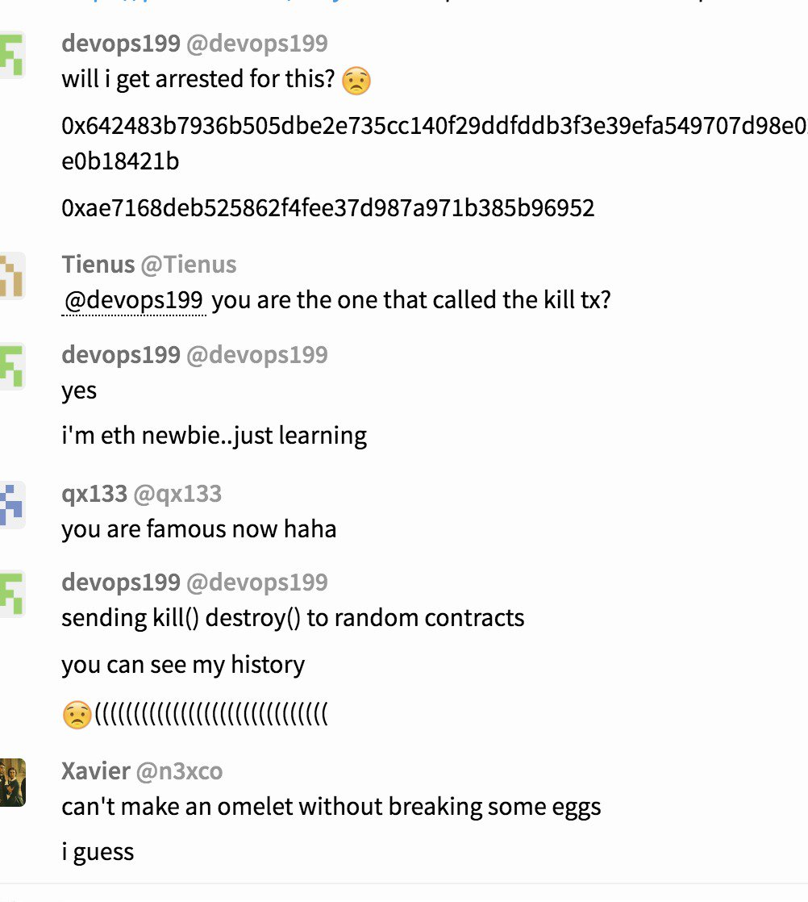

# Новый Security Alert от Parity или чего стоят ошибки в смартконтрактах 


7 Ноября [Parity](https://paritytech.io) [объявила](https://paritytech.io/blog/security-alert.html) о критической ошибке в коде, отвечающим за работу их multi-sig кошелька в основе которого лежит общедоступный [смарт-котракт](https://github.com/paritytech/parity/blob/v1.8.2/js/src/contracts/snippets/enhanced-wallet.sol). Это уже второй подобный случай, [первый](https://paritytech.io/blog/security-alert-high-2.html) произошел 19/07/2017 года, когда из-за найденной уязвимости смарт-контракта были выведены 150000 ETH ([Подробнее](https://habrahabr.ru/post/333754/)).

В этот раз пользователь GitHub [devops199](https://github.com/devops199), экспериентируя с публичными методами общедоступных смарт-контрактов вызвал метод `kill` смарт-контракта Parity. Issue [#6995](https://github.com/paritytech/parity/issues/6995) на GitHub. В результате этого около 1 миллиона ETH (около $300 миллионов) стали "заморожены", то есть лишены возможности быть истрачены.



Технически говоря, сперва он вызвал метод инициализации контракта initWallet
```
  function initWallet(address[] _owners, uint _required, uint _daylimit) only_uninitialized {
    initDaylimit(_daylimit);
    initMultiowned(_owners, _required);
  }
```
Модификатор `only_uninitialized` описан так
```
  // throw unless the contract is not yet initialized.
  modifier only_uninitialized { if (m_numOwners > 0) throw; _; }
```

Однако при размещении контракта список владельцев не был инициализован, и переменная `m_numOwners` был равна 0. Историю операций с контрактом можно посмотреть [здесь](https://etherscan.io/address/0x863df6bfa4469f3ead0be8f9f2aae51c91a907b4)

В результате вызов `initWallet` позволил `devops199` стать "владельцем" контракта и выполнить kill:
```
  // kills the contract sending everything to `_to`.
  function kill(address _to) onlymanyowners(sha3(msg.data)) external {
    suicide(_to);
  }
```

Операция `suicide` в EVM используется для уничтожения контракта и переводит весь оставшийся баланс на указанный адрес. При этом `suicide` эффективнее операции `send` и стоит отрицательное значение газа так как освобождает место от данных контракта в блокчейне.

Так как вся логика работы multi-sig кошелька была зависима от контракта, все владельцы, создавшие кошелек после 20/07/2017 (а это фактически все их пользователи, так как до 20 июля была другая уязвимость) потеряли доступ к возможности делать переводы своих средств из multi-sig кошельков (кроме как форка Ethereuma, который [не предвидится](https://twitter.com/VitalikButerin/status/928172344631115776)).

Статья с описанием проблемы на [medium.com](https://blog.springrole.com/parity-multi-sig-wallets-funds-frozen-explained-768ac072763c)
Обсуждение на [Reddit](https://www.reddit.com/r/ethereum/comments/7bchez/parity_multisig_wallets_deployed_after_730_issue/)


Для попапа:
### Что такое Multi-sig кошельки?
Multi-sig(nature) кошельки созданы для решения проблемы повышения защиты приватного ключа, так как для совершения транзакции необходимы 1 и более приватных ключей (в общем виде M из N ключей). Пример для случая 2 из 3 ключей: один ключ хранится локально, один в облаке, и еще 1 резервный (в укромном месте). Для совершения транзакции нужны 2 ключа. Чуть подробнее можно почитать [здесь](https://99bitcoins.com/what-is-multi%C2%ADsig-bitcoin-wallet-should-you-using-one/)


